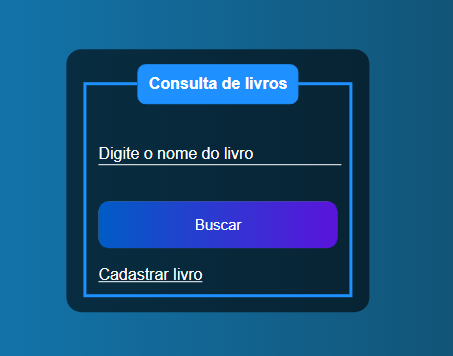

# Desafio Criação de sistema de cadastro de livros com :

#### Versão do Laravel utilizada: 8.69.0
É meu primeiro contato com laravel, meu forte é Frontend, mas disposto a aprender mais a cada dia !
__________________________________________________________________

### ..........🚧🚧 Projeto em construção! 🏗 👷 🧱🚧..........
________________________________________________________________
### Próximas etapas a serem feitas:

* 1- Relaciomento da tabela books com a tabela generou.
* 2- Consulta de locação do livro.
* 3- Testes de funcionamento da rota com o banco de dados entre as tabelas,  books e generou.
* 4- Conexão backend com frontend usando a view.
* 5- Inplementação de controle de usuários. 

________________________________________________________________
## Essa 1° versão tem o seguinte layout:

  

